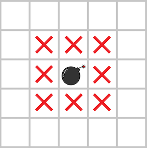

### 문제 링크

[문제 바로가기](https://school.programmers.co.kr/learn/courses/30/lessons/120866#)

### 문제 설명

다음 그림과 같이 지뢰가 있는 지역과 지뢰에 인접한 위, 아래, 좌, 우 대각선 칸을 모두 위험지역으로 분류합니다.


지뢰는 2차원 배열 `board`에 1로 표시되어 있고 `board`에는 지뢰가 매설 된 지역 1과, 지뢰가 없는 지역 0만 존재합니다.
지뢰가 매설된 지역의 지도 `board`가 매개변수로 주어질 때, 안전한 지역의 칸 수를 return하도록 solution 함수를 완성해주세요.


### 제한사항

- `board`는 n * n 배열입니다.
- 1 ≤ n ≤ 100
- 지뢰는 1로 표시되어 있습니다.
- `board`에는 지뢰가 있는 지역 1과 지뢰가 없는 지역 0만 존재합니다.


### 입출력 예시

| board |  result |
| --- |  --- |
| [[0, 0, 0, 0, 0], [0, 0, 0, 0, 0], [0, 0, 0, 0, 0], [0, 0, 1, 0, 0], [0, 0, 0, 0, 0]] | 16 | 
| [[0, 0, 0, 0, 0], [0, 0, 0, 0, 0], [0, 0, 0, 0, 0], [0, 0, 1, 1, 0], [0, 0, 0, 0, 0]] | 13 |


### 내 풀이

```python
def solution(board):
    n = len(board)
    answer = 0
    danger_idx = []

    for i in range(n):
        for j in range(n):
            if board[i][j] == 1:
                danger_idx.append((i, j))

    dx = [-1, -1, -1, 0, 0, 1, 1, 1]
    dy = [-1, 0, 1, -1, 1, -1, 0, 1]


    danger = [[0] * n for _ in range(n)]

    for x, y in danger_idx:
        for k in range(8):
            nx, ny = x + dx[k], y + dy[k]
            if 0 <= nx < n and 0 <= ny < n:
                board[nx][ny] = 1

    for i in range(n):
        for j in range(n):
            if board[i][j] == 0:
                answer += 1

    return answer
```


### 코드 설명
원래 풀이는 제공받은 리스트 자체에 근접한 위치를 모두 1로 바꾸는 접근법은 동일했음. 다만 모든 경우에 대해서 조건문을 작성함
그러다보니 모서리/가장자리 예외 처리에서 빠진 경우가 생김
아마 조건문에서 n-1 부근 인덱싱이 잘못됐던 듯


인덱스 범위를 체크하는 공통 로직으로 단순화 하라고 함
dx, dy 리스트를 만들어 for문으로 리스트를 순회함 

```python
if 0 <= ni < n and 0 <= nj < n:
```
같은게 된다는 걸 완전히 잊어버렸음..


### 다른 풀이
