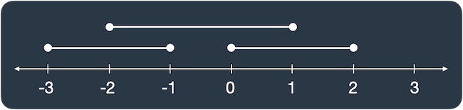

### 문제 링크

[문제 바로가기](https://school.programmers.co.kr/learn/courses/30/lessons/120876)

### 문제 설명

선분 3개가 평행하게 놓여 있습니다. 세 선분의 시작과 끝 좌표가 [[start, end], [start, end], [start, end]] 형태로 들어있는 2차원 배열 `lines`가 매개변수로 주어질 때, 두 개 이상의 선분이 겹치는 부분의 길이를 return 하도록 solution 함수를 완성해보세요.

`lines`가 [[0, 2], [-3, -1], [-2, 1]]일 때 그림으로 나타내면 다음과 같습니다.



선분이 두 개 이상 겹친 곳은 [-2, -1], [0, 1]로 길이 2만큼 겹쳐있습니다.


### 제한사항

- `lines`의 길이 = 3
- `lines`의 원소의 길이 = 2
- 모든 선분은 길이가 1 이상입니다.
- `lines`의 원소는 [a, b] 형태이며, a, b는 각각 선분의 양 끝점 입니다.
    - -100 ≤ a < b ≤ 100


### 입출력 예시

| lines |  result |
| --- |  --- |
| [[0, 1], [2, 5], [3, 9]] | 2 | 
| [[-1, 1], [1, 3], [3, 9]]	 | 0 |


### 내 풀이

```python
def solution(lines):
    mini = lines[0][0]
    maxi = lines[0][1]
    
    for line in lines:
        if line[0] < mini:
            mini = line[0]
        if line[1] > maxi:
            maxi = line[1]
            
    line_list = [0] * (maxi - mini)

    for line in lines:
        for i in range(line[0] - mini, line[1] - mini):
            line_list[i] += 1

    return line_list.count(2) + line_list.count(3)
```


### 코드 설명
리스트를 통해 수직선상에 나타냄. 최소값과 최대값을 찾아 (최대값-최소값) 길이의 리스트를 만들어 최소값의 인덱스가 0, 최대값의 인덱스가 n-1이 되도록 하여 해당하는 부분을 1을 더해줘서 1보다 큰 인덱스의 개수를 count


### 다른 풀이
```python
def solution(lines):
    mini = min(line[0] for line in lines)
    maxi = max(line[1] for line in lines)
    
    line_list = [0] * (maxi - mini)
    
    for start, end in lines:
        for i in range(start - mini, end - mini):
            line_list[i] += 1
            
    # 2 이상인 구간 길이 합
    return sum(1 for x in line_list if x >= 2)
```

가독성 코드 연습 해야할듯 